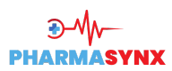

# PharmaSynx - Pharmacy Management System



## Overview

PharmaSynx is a comprehensive pharmacy management system designed to streamline pharmacy operations, inventory management, point of sale, and reporting. Built with Next.js and modern web technologies, this full-stack application provides pharmacies with powerful tools to enhance efficiency, reduce errors, and improve customer service.

## Features

- **Intuitive Dashboard**: Real-time overview of sales, inventory, and alerts
- **Point of Sale (POS)**: Fast, user-friendly checkout process with receipt generation
- **Inventory Management**: 
  - Track stock levels with automatic alerts for low inventory
  - Manage product categories and information
  - Record and monitor product expiration dates
- **Stock Control**: 
  - Add, update, and remove stock entries
  - Track batches and expiry dates
- **Reporting**: Generate comprehensive reports on sales, inventory, and business performance
- **Store Settings**: Customize application settings to match your pharmacy's specific needs
- **Keyboard Shortcuts**: Improve efficiency with built-in keyboard shortcuts

## Technology Stack

- **Frontend**: Next.js, React, TypeScript
- **Backend**: Next.js API routes, Node.js
- **Database**: SQLite (pharmacy.db)
- **Styling**: CSS/SCSS modules
- **Server**: Custom server.js implementation for SSE (Server-Sent Events)

## Getting Started

### Prerequisites

- Node.js (v18.0.0 or higher)
- npm or yarn

### Installation

1. Clone the repository:
   ```bash
   git clone https://github.com/muhammadsamiirshad/PharmaSynx.git
   cd PharmaSynx_final
   ```

2. Install dependencies:
   ```bash
   npm install
   # or
   yarn install
   ```

3. Set up the database:
   ```bash
   npm run migrate
   # or
   yarn migrate
   ```

4. Run the development server:
   ```bash
   npm run dev
   # or
   yarn dev
   ```

5. Open [http://localhost:3000](http://localhost:3000) in your browser to access PharmaSynx.

## Usage

### Dashboard

The dashboard provides an overview of key metrics and quick access to essential functions. Monitor sales, inventory alerts, and daily activities from one central location.

### Managing Inventory

1. Navigate to the inventory section
2. Add new products using the Add Product modal
3. Organize products by categories
4. Set up low-stock alerts to stay informed about inventory needs

### Processing Sales

1. Access the POS (Point of Sale) from the main navigation
2. Scan or search for products
3. Add items to the current transaction
4. Process payment and generate receipts

### Generating Reports

Access the Reports section to generate and export various business reports, including:
- Sales summaries
- Inventory status
- Expiring products
- Performance metrics

## Configuration

PharmaSynx can be customized through the Store Settings component to match your pharmacy's specific requirements.

## Development

### Project Structure

```
├── public/              # Static assets
├── src/
│   ├── app/             # Next.js app directory
│   │   ├── Components/  # React components
│   │   ├── dashboard/   # Dashboard page
│   │   ├── pages/       # Additional pages
│   │   ├── utils/       # Utility functions
│   │   ├── layout.tsx   # Root layout
│   │   └── page.tsx     # Home page
├── server.js            # Custom server implementation
├── migrate.js           # Database migration script
└── reset-db.js          # Database reset utility
```

### Building for Production

```bash
npm run build
# or
yarn build
```

Start the production server:

```bash
npm start
# or
yarn start
```

## License

This project is licensed under **All Rights Reserved**.  
You may view the code, but you **may not copy, modify, or distribute** it.  
Contact samiirshad825@gmail.com for permissions.

## Contact

Muhammad Samir Irshad - [GitHub](https://github.com/muhammadsamiirshad)

Project Link: [https://github.com/muhammadsamiirshad/PharmaSynx](https://github.com/muhammadsamiirshad/PharmaSynx)

---

**PharmaSynx** - Empowering pharmacies with modern technology
